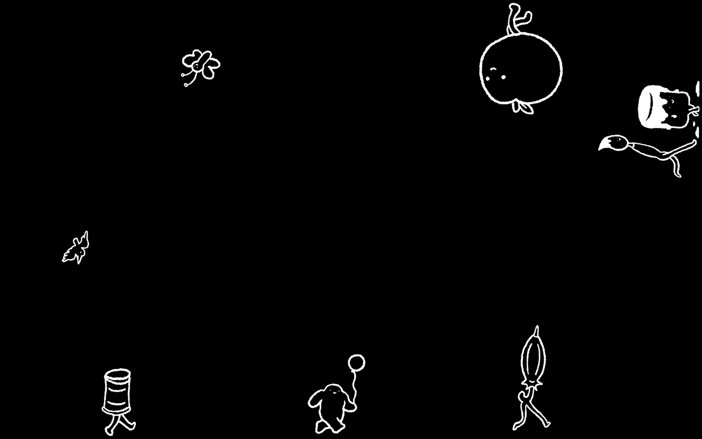

# Screen Saver by Suerynn Lee

A macOS screen saver made for the artist and writer [Suerynn Lee](https://www.suerynn.com/).

Nineteen hand-drawn characters — a walking apple, a peanut in a top hat, a pair of trousers, an umbrella, a very long-legged pea and more — stroll around the edges of your screen.

## Install

1. Download **Suerynn-Saver.zip** from the [latest release](https://github.com/adamoadamo/suerynn-screensaver/releases/latest) and unzip it.
2. Double-click the **.saver** file inside and click **Install**.
3. Open **System Settings → Screen Saver** and choose **Suerynn Saver** (under *Other*).

Requires macOS 12 or later, on Apple silicon or Intel.

## Build from source

Open `Suerynn Saver.xcodeproj` in Xcode and build the **SuerynnSaver** scheme, then double-click the resulting `.saver` to install it. The **ScreensaverPreview** scheme runs the saver in a window, which is quicker for testing. If you're not on the original signing team, pick your own under *Signing & Capabilities*.

## Credits

Characters and artwork ©2025 Suerynn Lee. 
All rights reserved.
